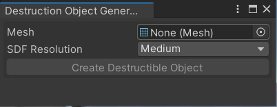
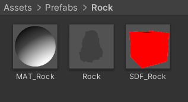
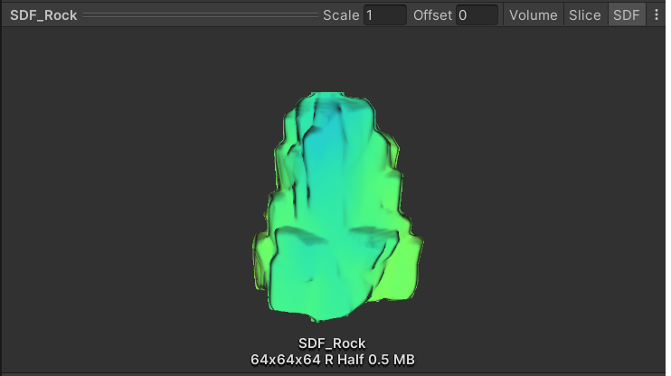
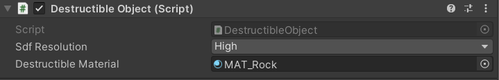
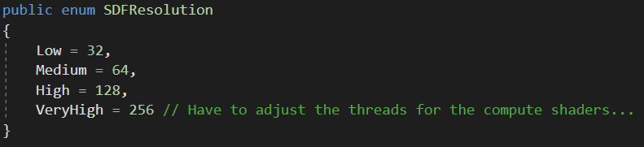

## Starting using Signed Distance Field Destruction
Select `Prototype/Destructible Object Generator` in the menu bar to start creating your own destructible asset.

1. **Mesh** : Assign the mesh you want to convert to a destructible object.
2. **SDF Resolution** : Decides the resolution for the SDF. See `Destructible Object Component` for more information.
3. **Create Destructible Object** : This will open up a save panel. Choose the location you want to save the generated object.

The end result should look like this:

* **Material** : The destructible material, specifically for this asset.
* **Prefab** : A prefab of the destructible asset.
* **SDF** : A SDF of the destructible asset. A preview can be visualised when viewed in the inspector.

## Destructible Object Component
The **DestructibleObject.cs** is automatically assigned to the generated destruction prefab. This component is responsible for managing the destruction. Currently there is only one function you can call to apply damage: `AddDamage( Vector3 hitPoint, Vector3 hitDir, float radius)`. In code you do have the option to choose between CPU or GPU based destruction.

* **Sdf Resolution** : Decides the resolution in px³ for the signed distance field of the destruction/damage. 

> **Note**: Very High or 256px³ is currently not fully supported.

* **Destructible Material** : Is a reference to the destructible material for this asset.

## Shader Overview
In the DestructionShader.shader we divide our structure into three different parts.
1. **Vertex** : Converting the vertex position to the SDF position and calculating our ray.
2. **Fragment** : Sampling our SDF. In case the distance is smaller than 0, we call the raymarch function.
3. **Raymarching** : We use the sphere tracing technique to determine if we reached a surface, if we reach a surface we calculate the visuals.

For more information about raymarching:
* [Iquilezles.org](https://iquilezles.org)
* [The Art of Code](https://www.youtube.com/c/TheArtofCodeIsCool)
* [Shadertoy](https://www.shadertoy.com)

## Compute Shaders
You can find the compute shaders located at `Assets\Compute Shaders\Resources`. This folder contains three important files for the destruction method to work.
1. **CreateSDF.compute** : Generates an SDF of a mesh model. This file is executed when generating the destructible asset.
2. **CreateEmptySDF.compute** : Generates an empty SDF, to apply our future destruction/damage on.
3. **ApplyDamage.compute** : Applies destruction on the SDF according to the minimum signed distance function of the destruction type.
