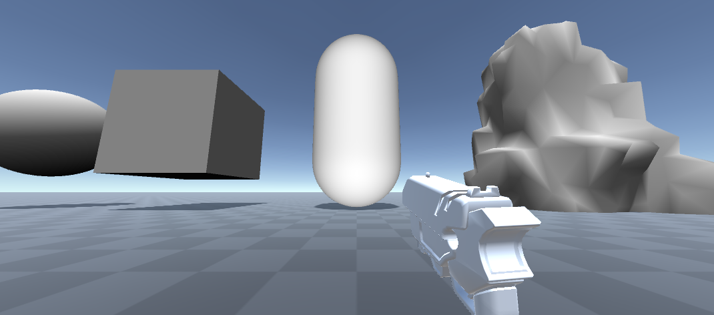

# Sample
Sample scene is automatically included in this repository.
The sample scene scene can be found by opening the project and opening the `Assets\Scenes\SampleScene.unity` file. And includes four default objects for destruction.
* Sphere
* Cube
* Capsule
* Custom non-convex mesh

This sample demonstrates how to use the destruction prototype and how you can apply the destruction through a first person shooter experience. In the guncontrol component you can adjust the frequency and the radius of the destruction.

> **Note**: Sample scene only supports the Legacy (Build-in) render pipeline. See [Requirements](requirements.md) for more information.
