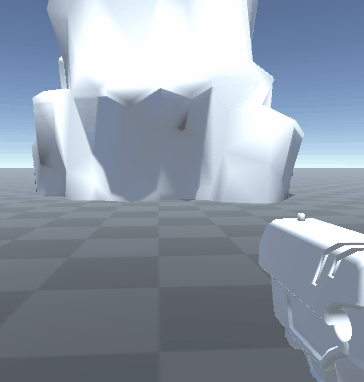
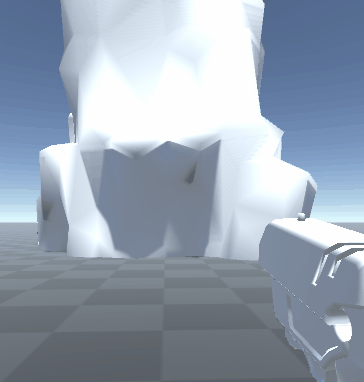
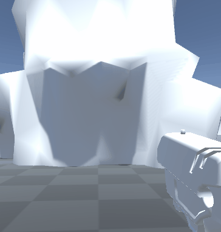

# Signed Distance Field Destruction on Mesh Data
Summary and general info

  
   
  

* [Requirements](Documentation~/requirements.md)
* [Installation](Documentation~/installation.md)
* [Instruction](Documentation~/instruction.md)
* [Samples](Documentation~/sample.md)
> **Note**: This method is still in the prototyping phase.
